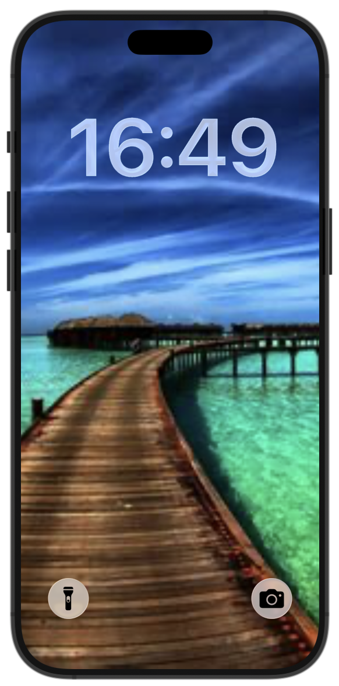
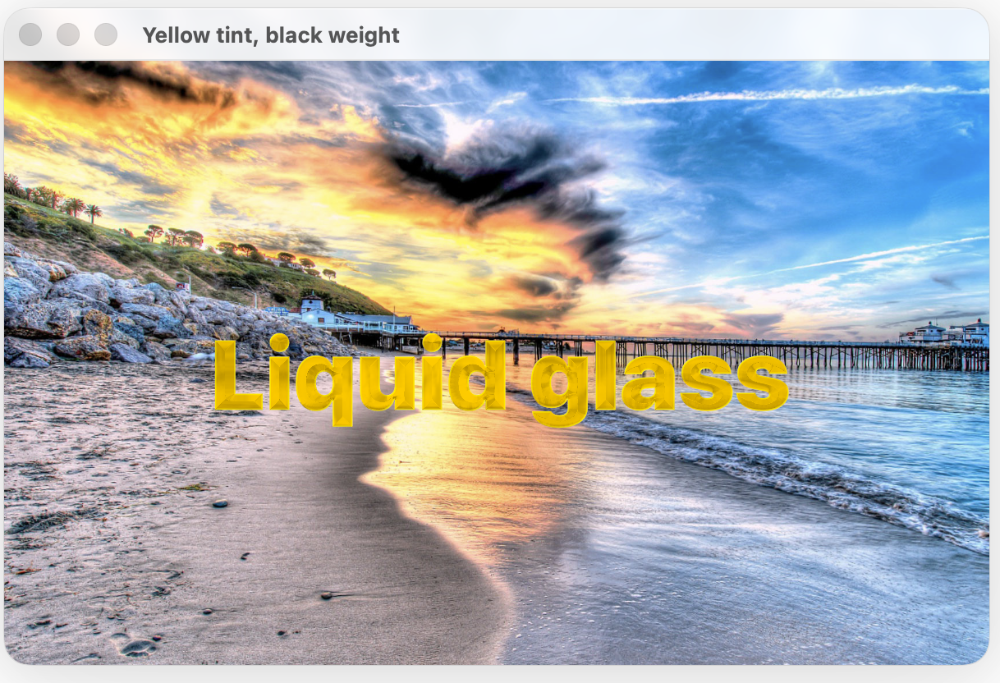
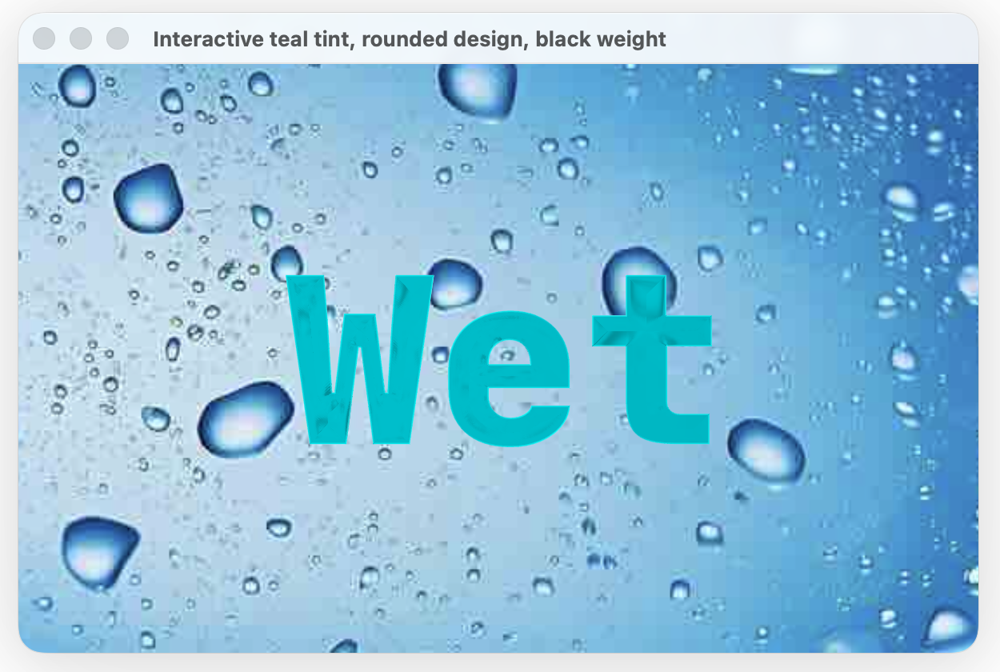
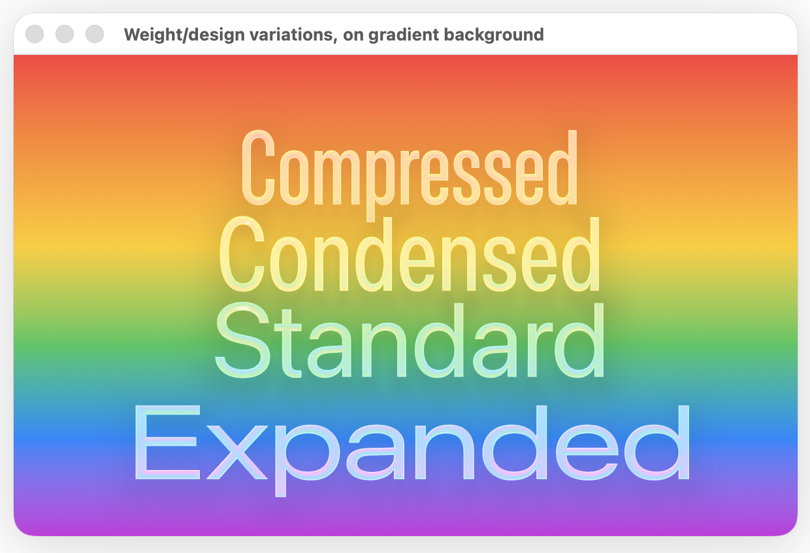
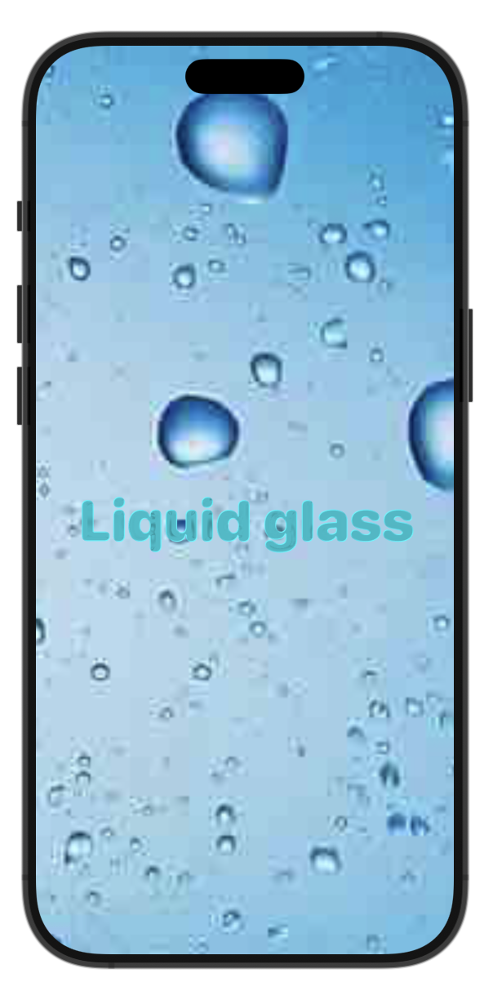

#  LiquidGlassText

This simple Swift package allows you to display text views (like `Text("Hello world!")`) filled with Apple's new iOS 26 Liquid glass, for iOS, macOS, watchOS, tvOS, visionOS, all the main platforms.

## Advantages

1. You can display text using liquid glass
2. Text fits better into Apple's ecosystem, and looks consistent on all platforms
3. You can use all the variations of liquid glass, like `regular`, `tint`ed, `interactive`, and `clear`
4. It better separates your views into layers, with liquid glass floating neatly above other views
5. It is super easy to implement -- just replace a `Text` view with `LiquidGlassText`.
6. It supports custom fonts so you can add your own branding in liquid glass
7. you can use it with other liquid glass modifiers like `glassEffectTransition`, `glassEffectID`, and in `GlassEffectContainer`

### Previews

## Disadvantages

1. The main disadvantage is that `LiquidGlassText` does **NOT YET SUPPORT MULTILINE TEXT**
2. It cannot be used for medium/large bodies of text, only short single-line statements (like a timer, number, or simple name)
3. Because it only supports single-line text, modifiers like `.lineLimit`, `.truncationMode`, `minimumScaleFactor` among others are not yet supported.
4. You will need to remove `.font` modifiers and place the parameters size, weight, design, and width into the initializer for `LiquidGlassText`.

## How I made it

It is a relatively straight forward library. Originally I saw the Apple screenshots including the lock screen clock in liquid glass, and wanted to use this, although there is no official API released yet -- thanks again tim cook :-{}.

So, I started thinking, how could I implement this myself -- a fun swift challenge! Well, the `glassEffect` modifier can be applied to any views and accepts the type of glass to use, and the *shape* to fill. Liquid glass filled shapes, so I need to convert my text strings to a shape! 

Without wanting to waste too much time reading docs / stack-overflow articles on how to do this, I used Xcode's AI generate a `TextHelper` that takes in an attributed string, and return a `Path` that shapes are made of. I can then put this in the glass effect to fill.

After some back/forth with AI and testing with `#Preview` it was finally working and converting text to paths. Now, it is time to create the wrapper view `LiquidGlassText` that is respomnsible for taking input of the `String`, `NSAttributedString`, and other initializers that accept system font size, weight, dsign & width, and custom font name and size.

One more tricky thing, which again, I used AI to help me with (do it for me) was turning these parameters into the attributed string, and it looks like it is using font descriptors to add these traits.

Last thing was to look around for some cool pics and assemble the previews :)

### Thanks for using this package!
